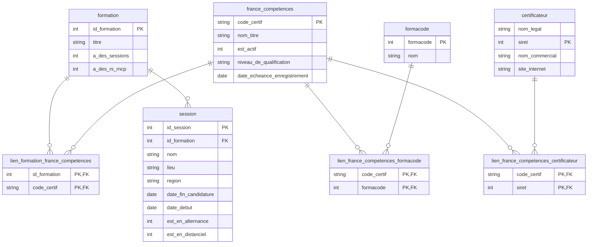

```mermaid
erDiagram
    formation {
        int id_formation PK
        string titre 
        int a_des_sessions
        int a_des_rs_rncp
       
    }

    france_competences {
        string code_certif PK
        string nom_titre
        int est_actif
        string niveau_de_qualification
        date date_echeance_enregistrement
    }
    
    lien_formation_france_competences {
        int id_formation PK,FK
        string code_certif PK,FK
    }

    formacode{
        int formacode PK
        string nom
    }

    lien_france_competences_formacode {
        string code_certif PK,FK
        int formacode PK,FK
    }

    certificateur{
        string nom_legal
        int siret PK
        string nom_commercial
        string site_internet 
    }

    lien_france_competences_certificateur{
        string code_certif PK,FK
        int siret PK,FK
    }

    session{
        int id_session PK
        int id_formation FK
        string nom
        string lieu
        string region
        date date_fin_candidature
        date date_debut
        int est_en_alternance
        int est_en_distanciel
    }

    formation ||--o{ lien_formation_france_competences : ""
    france_competences ||--o{ lien_formation_france_competences : ""
    
    france_competences ||--o{ lien_france_competences_formacode : ""
    formacode ||--o{ lien_france_competences_formacode : ""
    
    france_competences ||--o{ lien_france_competences_certificateur : ""
    certificateur ||--o{ lien_france_competences_certificateur : ""

    formation ||--o{ session : ""
    
```